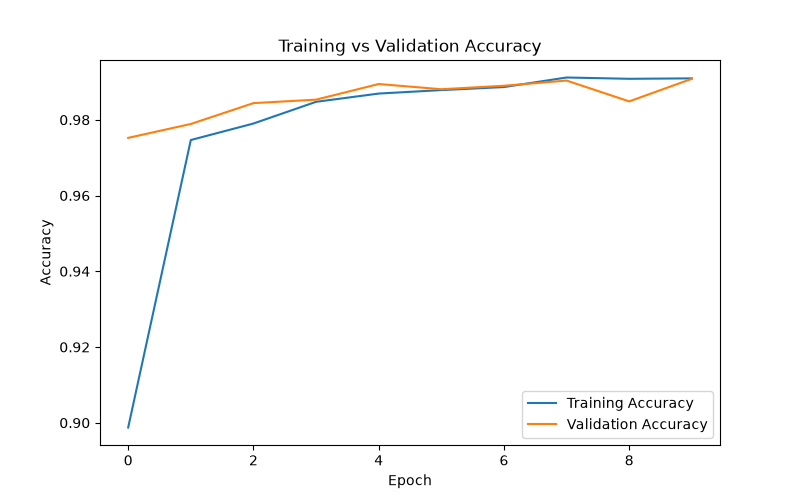
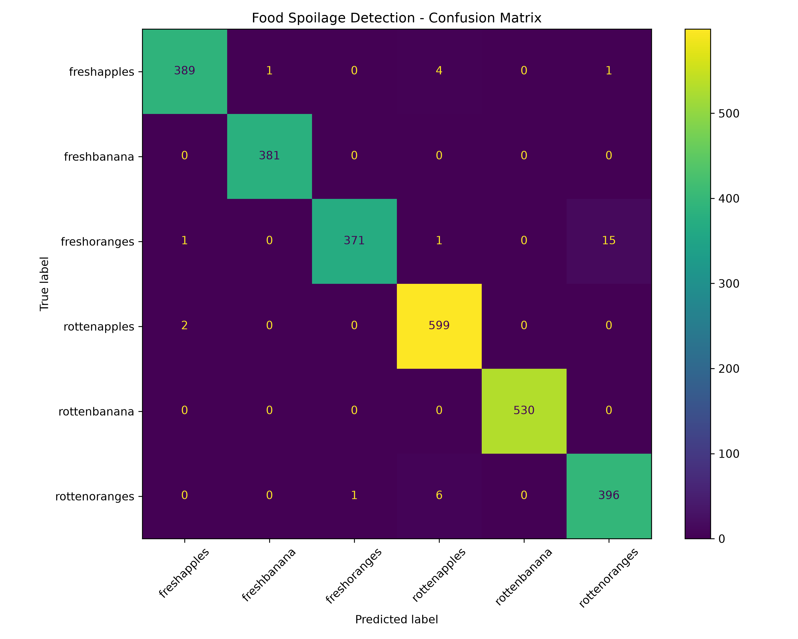
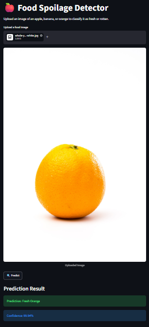

# 🍎 AI-Based Food Spoilage Detection

An AI-powered image classification system that detects whether an apple, banana, or orange is **fresh or rotten** using Computer Vision and Deep Learning.

## 🎯 Project Overview

Food spoilage can lead to significant household food waste. This project uses a deep learning image classification model to identify the condition of common fruits from an uploaded image.

The system classifies images into six categories:

- 🍎 Fresh Apple
- 🍌 Fresh Banana
- 🍊 Fresh Orange
- 🍎 Rotten Apple
- 🍌 Rotten Banana
- 🍊 Rotten Orange

The trained model is integrated with a **Streamlit web application** where users can upload a fruit image and receive a predicted class with confidence.

## ✨ Features

- Image-based fruit condition classification
- Six fresh/rotten fruit categories
- Transfer learning using MobileNetV2
- Data augmentation for better generalization
- Model evaluation using accuracy, precision, recall, F1-score, and confusion matrix
- Interactive Streamlit web interface
- Prediction confidence score

## 🧠 Model

The project uses **MobileNetV2** with ImageNet pretrained weights.

### Model Pipeline

```text
Input Image
     ↓
Resize to 224 × 224
     ↓
Data Augmentation
     ↓
MobileNetV2
     ↓
Global Average Pooling
     ↓
Dropout
     ↓
Softmax Classification
     ↓
Predicted Fruit Condition
````

MobileNetV2 was selected because it provides a good balance between classification performance and computational efficiency.

## 📊 Results

The model was evaluated on a separate test dataset containing **2,698 images**.

| Metric              |     Result |
| ------------------- | ---------: |
| Validation Accuracy | **99.08%** |
| Test Accuracy       | **98.81%** |
| Macro F1-Score      |   **0.99** |
| Weighted F1-Score   |   **0.99** |

The confusion matrix and class-wise evaluation were used to analyze model performance across all six classes.

## 🗂️ Dataset

The dataset contains images organized into training and testing folders according to their fruit-condition labels.

### Classes

```text
freshapples
freshbanana
freshoranges
rottenapples
rottenbanana
rottenoranges
```

The dataset is **not included in this repository** because of its size.

## 🛠️ Tech Stack

* Python
* TensorFlow / Keras
* MobileNetV2
* OpenCV
* NumPy
* Pandas
* Scikit-learn
* Matplotlib
* Pillow
* Streamlit

## 📁 Project Structure

```text
food-spoilage-detection/
│
├── app/
│   └── app.py
│
├── data/
│   └── README.md
│
├── dataset/
│   ├── train/
│   └── test/
│
├── models/
│   └── README.md
│
├── notebooks/
│
├── screenshots/
│   └── README.md
│
├── src/
│   ├── train.py
│   ├── predict.py
│   └── evaluate.py
│
├── .gitignore
├── README.md
└── requirements.txt
```

## ⚙️ Installation

Clone the repository:

```bash
git clone https://github.com/Kauraamrit/food-spoilage-detection.git
cd food-spoilage-detection
```

Create and activate a virtual environment:

```bash
python -m venv venv
```

Windows:

```bash
venv\Scripts\activate
```

Install dependencies:

```bash
pip install -r requirements.txt
```

## ▶️ Training the Model

Place the dataset inside:

```text
dataset/
├── train/
└── test/
```

Then run:

```bash
python src/train.py
```

The trained model will be saved as:

```text
models/food_spoilage_model.keras
```

## 🔍 Making Predictions

Run:

```bash
python src/predict.py
```

Enter the path of an image when prompted.

## 🌐 Run the Streamlit Application

Start the application using:

```bash
streamlit run app/app.py
```

The application allows users to upload an image and receive:

* Predicted fruit condition
* Prediction confidence

## 📈 Evaluation

To evaluate the trained model on the test dataset:

```bash
python src/evaluate.py
```

This generates:

* Test accuracy
* Classification report
* Confusion matrix

## 📸 Results & Screenshots

### Training vs Validation Accuracy



### Confusion Matrix



### Streamlit Application



### Streamlit Application

The Streamlit application allows users to upload a fruit image and receive a predicted fruit condition with confidence.

## ⚠️ Limitations

* The model is currently limited to three fruit types: apples, bananas, and oranges.
* It only distinguishes between fresh and rotten conditions.
* Performance may vary with different lighting, backgrounds, camera quality, and fruit varieties.
* A visual classification model cannot determine the complete internal safety or edibility of food.

## 🚀 Future Improvements

* Add more fruit and vegetable categories
* Use a larger and more diverse dataset
* Improve robustness to real-world images
* Add real-time camera detection
* Deploy the application online
* Explore fine-tuning of the pretrained MobileNetV2 layers
* Add explainable AI techniques such as Grad-CAM

## 👩‍💻 Author

**Amrit Kaur**

B.Tech – Artificial Intelligence & Data Science

